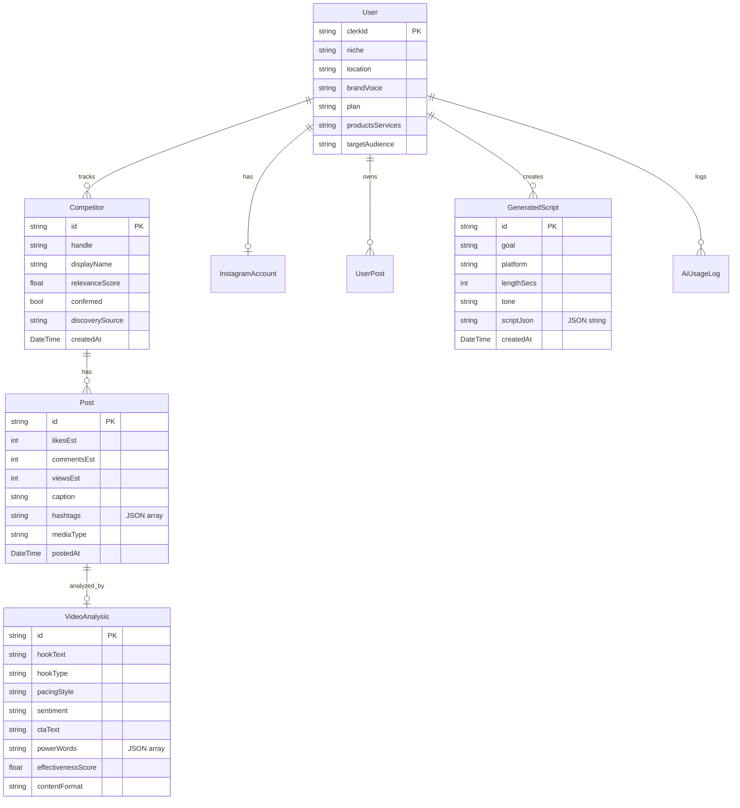
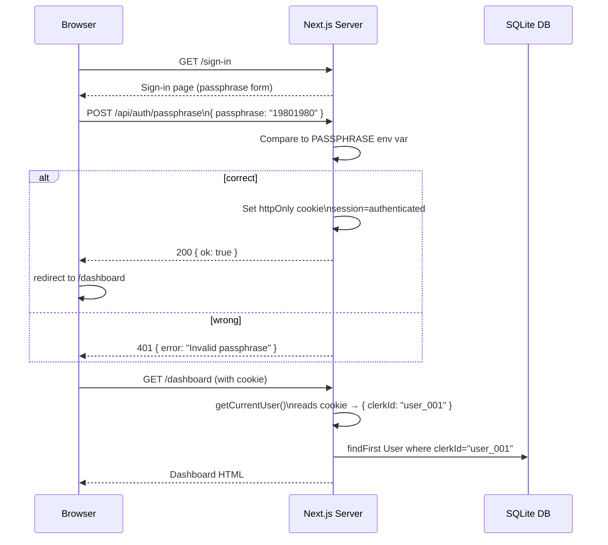
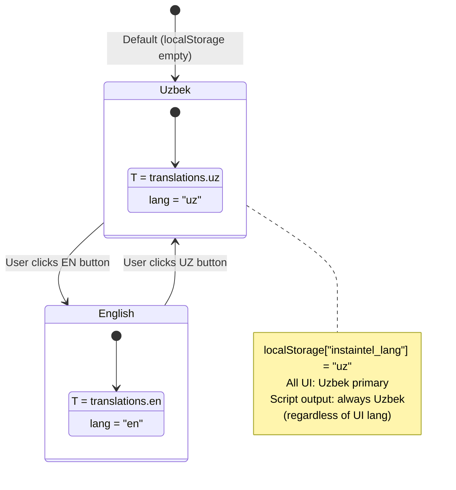
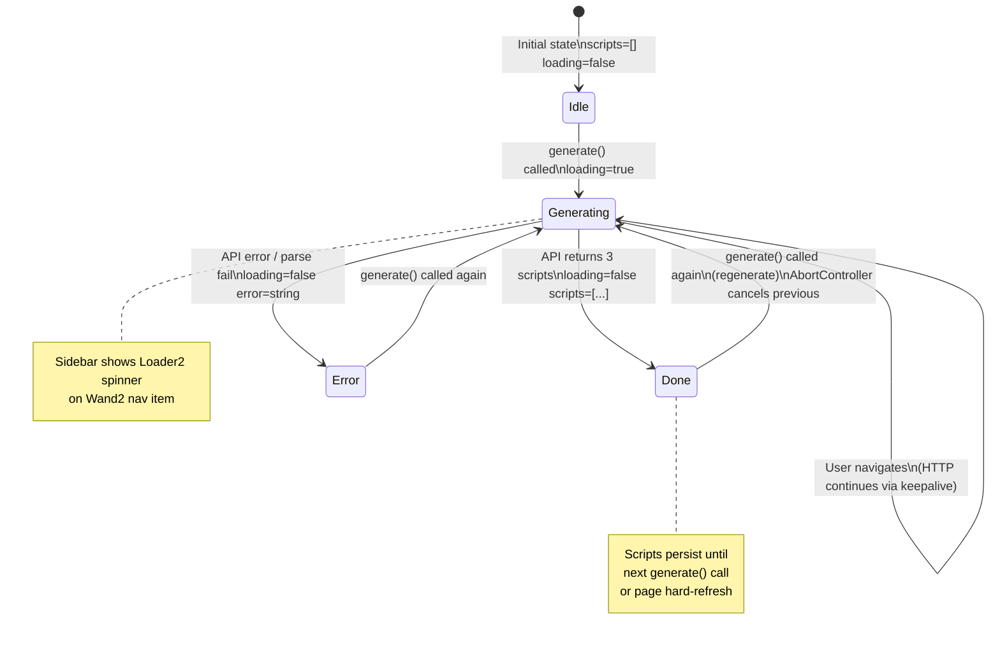

# Flows & Diagrams

Mermaid diagrams for all key InstaIntel pipelines. Render with any Mermaid-compatible viewer (GitHub, VS Code extension, mermaid.live).

---

## 1. Competitor Discovery Pipeline

```mermaid
flowchart TD
    A([User clicks\n"Discover Competitors"]) --> B[POST /api/competitors/discover]
    B --> C{7-day cache\nin DB?}
    C -- Yes --> D[Return cached\ncandidates]
    C -- No --> E[buildRealEstateTags\nuysotuv · kotedj · kvartirasotuv\nuytoshkent · yaniqurilis]

    E --> F[Apify\ninstagram-hashtag-scraper]
    F --> G[Raw candidates\nfrom hashtag posts]

    G --> H[buildCompetitorFilterPrompt\nv2.0.0 — strict real estate only\nbuston.village context]
    H --> I[OpenRouter\nGemini 2.5 Flash]
    I --> J[Parse JSON response\nregex /filtered.*?\}/]
    J --> K{score ≥ 70?}

    K -- Yes --> L[Save to DB\nconfirmed=false]
    K -- No --> M[Discard\nexcluded_count++]

    L --> N[Return candidates\nto UI]
    D --> N

    N --> O[User reviews candidates\nDiscoveryPanel]
    O --> P[POST /api/competitors/confirm\nselected handles]
    P --> Q[DB update\nconfirmed=true]
    Q --> R([Competitors ready\nfor analysis])

    style I fill:#4f46e5,color:#fff
    style F fill:#059669,color:#fff
    style M fill:#dc2626,color:#fff
```

### Key rules enforced by the filter prompt
- **Hard exclusions:** content/marketing agencies, CRM tools, renovation companies, education platforms
- **Required signals:** property listings, pricing, project presentations, real estate vocabulary
- **When in doubt:** EXCLUDE (explicit instruction in prompt v2.0.0)
- **Max results:** 10 competitors per run

---

## 2. Competitor Analysis Pipeline

```mermaid
flowchart TD
    A([User clicks\n"Run Analysis"]) --> B[POST /api/analyze/start]
    B --> C[Fetch confirmed\ncompetitors from DB]
    C --> D{For each\ncompetitor}

    D --> E[Apify instagram-scraper\nactor run — max 50 posts]
    E --> F[Posts returned\nwith likes · comments · caption · hashtags]

    F --> G{For each post\nparallel batch}
    G --> H[buildVideoAnalysisPrompt\nniche + caption + post data]
    H --> I[OpenRouter\nGemini 2.5 Flash]
    I --> J[Parse VideoAnalysis JSON\nhook · pacing · sentiment\ncta · power_words · hashtags]
    J --> K[Upsert Post + VideoAnalysis\nto SQLite DB]

    K --> L{More posts?}
    L -- Yes --> G
    L -- No --> M{More competitors?}
    M -- Yes --> D
    M -- No --> N[GET /api/analyze/results]

    N --> O[safeParseArray · countFreq · helpers\nAggregate from DB — NO extra AI calls]
    O --> P[Per-competitor stats\navg_likes · avg_comments · top_hashtags\nhook_examples · value_prop_examples]
    O --> Q[Global aggregates\nhashtag_cloud top 25\nhook_breakdown %\nsentiment_breakdown\npacing_breakdown\ncontent_format_breakdown\ntop_ctas · power_words]
    O --> R[buildNicheSummary\npure computation from DB data]

    P & Q & R --> S[Return full JSON\nto Analysis page UI]
    S --> T([Uzbek analysis\ndisplayed to user])

    style I fill:#4f46e5,color:#fff
    style E fill:#059669,color:#fff
    style O fill:#0369a1,color:#fff
    style R fill:#0369a1,color:#fff
```

---

## 3. Script Generation Pipeline (Navigation-Persistent)

```mermaid
flowchart TD
    A([User sets goal · platform\nlength · tone]) --> B[ScriptsContext.generate]
    B --> C[Cancel previous AbortController\ncreate new one]
    C --> D[POST /api/scripts/generate\nkeepalive: true\nAbortController signal]

    D --> E{User navigates\naway?}
    E -- Yes --> F[HTTP request continues\nkeepalive keeps socket open]
    E -- No --> G[Same page]
    F & G --> H[Server: buildScriptGenerationPrompt\nUzbek real estate context\n3 variations requested]

    H --> I[OpenRouter\nGemini 2.0-flash-001\nmax_tokens: 4096]
    I --> J[Extract JSON\nregex /\{[\s\S]*\}/]
    J --> K[Parse 3 GeneratedScript objects\nconcept_title · hook_type · scenes\ncaption · hashtags · thumbnail_idea\npredicted_strength]

    K --> L[Return scripts to client\nResponse body]
    L --> M[ScriptsContext updates state\nscripts, loading=false]

    K --> N[DB persist — fire and forget\nJSON.stringify scripts\nPromise.all catch — non-blocking]

    M --> O{User on\nscripts page?}
    O -- Yes --> P([Scripts displayed\nimmediately])
    O -- No --> Q([Scripts ready when\nuser navigates back])

    subgraph Sidebar
        R[Wand2 nav item]
        R --> S{scriptsLoading?}
        S -- Yes --> T2[Loader2 spinner\nanimate-spin]
        S -- No --> U[AI badge\npink]
    end

    style I fill:#4f46e5,color:#fff
    style N fill:#6b7280,color:#fff
    style F fill:#059669,color:#fff
```

---

## 4. Overall Data Architecture



---

## 5. Auth Flow (Development)



---

## 6. i18n Language Switching



---

## 7. ScriptsContext State Machine


